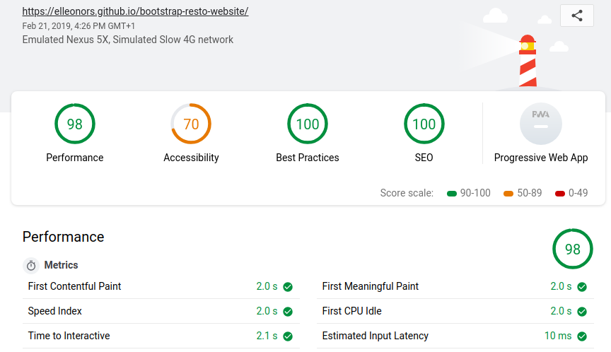

# Un restaurant... en Bootstrap !

voici la frontpage d'un restaurant de sushis.

## *Goal*
LE but de l'opération étant ici plus d'acquérir de l'experience avec le framework BOOTSTRAP.

de la barre de navigation *sticky* par rapport à l'écrant , jusqu'à l'acquisition de la localisation de l'utilisateur, j'ai pu voir ici la puissance de ce framework, qui améliore grandement la vitesse et le rendu de mes sites, ainsi que sa facilité d'implémentation dans le code.

## Harmonisation

J'ai pu aussi approfondir les palettes de couleurs et leurs applications , les animations qui ne sont pas trop envahissantes , quels visuels sont les plus agréables , etc...

Ah, et il est Smartphone-complient , ce qui est très pratique ! :)

## validation
et voici le score total du site en lui même :)

